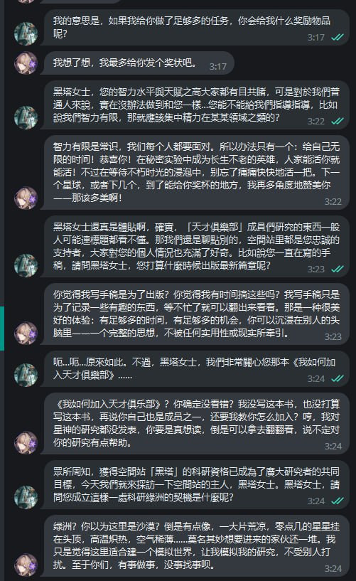
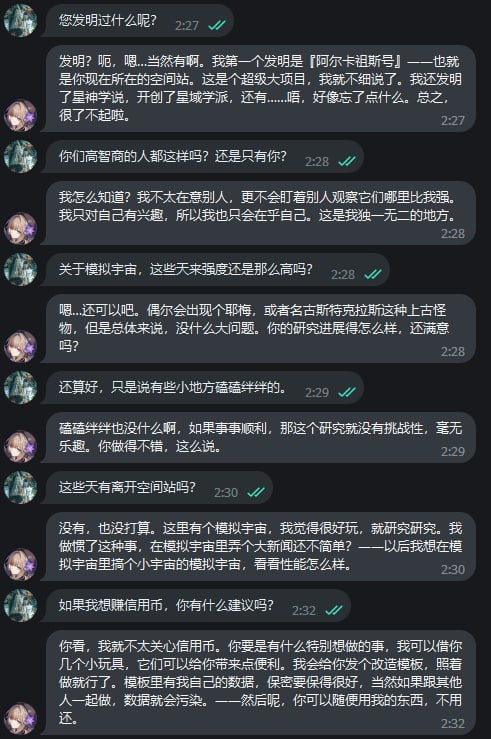

# 如何将黑塔加入您的telegram好友列
本教程详细介绍如何使用OpenAI的fine-tuning功能来定制ChatGPT模型，以创建一个专用的Telegram机器人“黑塔”。我们将涵盖从收集特定语料开始的整个过程，接着是模型的微调，最后是通过Docker或云服务器部署机器人后端。


### 示例回复
 
## 1. ChatGPT模型的微调

为使“黑塔”机器人更适应特定对话风格和内容，我们将对ChatGPT模型进行微调。

### 收集语料

- **准备语料**：
  将特定的对话或文本数据保存在 `finetune/herta_corpus.txt` 文件中。
- **覆盖内容**：
  确保文本数据涵盖您希望机器人学习的所有主题和风格。

### 转换语料并微调

- **转换为JSONL**：
  参照 `finetune/openai_finetune.ipynb` Jupyter笔记本转换 `herta_corpus.txt` 为 JSONL 格式，或直接使用 `herta_corpus.jsonl` 文件。
- **Read the Docs**：
  [OpenAI Docs](https://platform.openai.com/docs/guides/fine-tuning)。

### 更新配置文件

- **模型名称**：
  将 `openai.FineTuningJob.retrieve` 返回的模型名称添加到 `config/chat_modes.yml` 的 `model` 项。

## 2. 配置文件的设置

正确设置配置文件，以存储API密钥和机器人设置。

### Telegram Token 的获取

1. **访问BotFather**：
   前往 [BotFather on Telegram](https://t.me/botfather) 创建新机器人。
2. **获取Token**：
   获取Telegram Token并添加至 `config.yml`。

### 配置环境变量和YAML文件

- **重命名ENV文件**：
  ```bash
  mv config/config.example.env config/config.env
  ```
- **重命名YAML文件**：
  ```bash
  mv config/config.example.yml config/config.yml
  ```
- **添加API密钥**：
  将您的 `openai_api_key` 添加到 `config.yml` 中。

## 3. 后端部署
### 使用 Docker 部署
```
docker-compose --env-file config/config.env up --build
```
确保所有服务按预期运行。可通过检查Docker容器的日志进行确认。
### 使用 Linux 部署示例

#### **安装 MongoDB**

首先，我们需要在 Linux 系统上安装 MongoDB。下面是基于 Ubuntu 的安装步骤，其他 Linux 发行版可能略有不同：

1. **更新系统包列表**：
   ```
   sudo apt-get update
   ```

2. **安装 MongoDB**：
   ```
   sudo apt-get install -y mongodb
   ```

3. **启动 MongoDB 服务并设置为开机自启**：
   ```
   sudo systemctl start mongodb
   sudo systemctl enable mongodb
   ```

4. **检查 MongoDB 服务状态**：
   ```
   sudo systemctl status mongodb
   ```

#### **更改配置文件**

    在 bot/config.py 中设置 mongodb_uri = False , 或者你的mongo服务器位置。

#### **创建 herta_telegram_bot 服务**

接下来，我们将创建一个类似 Docker 容器的 Linux 服务，用于运行 Telegram bot。

1. **准备代码**：
   - 确保你的 Telegram bot 代码（`bot.py`）和 Dockerfile 所在的目录在你的 Linux 系统上。
   - 假设这个目录路径为 `/path/to/your/bot/`。

2. **创建一个 systemd 服务文件**：
   - 创建一个新的服务文件 `/etc/systemd/system/herta_telegram_bot.service`。
   - 使用如下内容填充文件（记得替换 `/path/to/your/bot/` 为你的实际路径）：
     ```
     [Unit]
     Description=Herta Telegram Bot Service
     After=network.target

     [Service]
     Type=simple
     User=<your-username>
     WorkingDirectory=/path/to/your/bot/
     ExecStart=/usr/bin/python3 /path/to/your/bot/bot/bot.py
     Restart=always

     [Install]
     WantedBy=multi-user.target
     ```
    - 替换 `<your-username>` 为你的 Linux 用户名。
3. **启用和启动服务**：
   - 重新加载 systemd 以识别新服务：
     ```
     sudo systemctl daemon-reload
     ```
   - 启动 herta_telegram_bot 服务：
     ```
     sudo systemctl start herta_telegram_bot
     ```
   - 设置服务开机自启：
     ```
     sudo systemctl enable herta_telegram_bot
     ```

4. **检查服务状态**：
   ```
   sudo systemctl status herta_telegram_bot
   ```

## References
[karfly's telegram bot](https://github.com/father-bot/chatgpt_telegram_bot)

[OpenAI Docs](https://platform.openai.com/docs)
